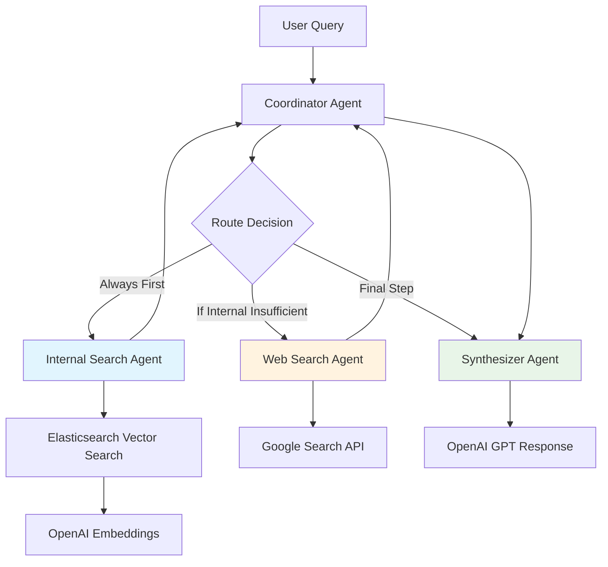
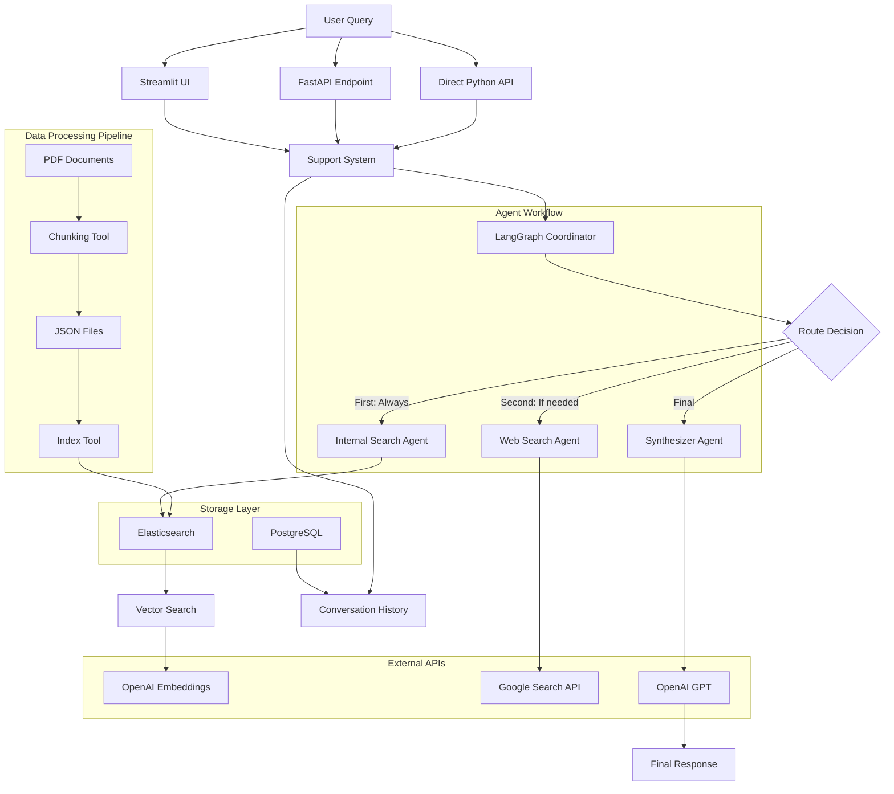

# Multi-Agent Support System

The technical support system powered by **LangGraph** that intelligently answers questions using internal documentation and web search.

## Architecture

The system uses a multi-agent workflow that prioritizes internal documentation over web search:



### Complete System Architecture



## Multi-Agent Flow

1. **Coordinator Agent**: Routes between search and synthesis based on iteration and result quality
2. **Internal Search Agent**: Vector search through indexed documentation using Elasticsearch
3. **Web Search Agent**: Fallback Google search when internal results are insufficient  
4. **Synthesizer Agent**: Combines sources into coherent responses using GPT

## Quick Start

### Prerequisites
```bash
# Required services
docker-compose up -d  # Starts Elasticsearch + PostgreSQL
```

### Environment Setup

Create `.env` file:

```env
# OpenAI
OPENAI_API_KEY=your_openai_key
OPENAI_LLM_MODEL=gpt-3.5-turbo
OPENAI_EMBEDDING_MODEL=text-embedding-3-small

# Elasticsearch  
ELASTICSEARCH_URL=http://localhost:9200
ELASTICSEARCH_INDEX_NAME=support_docs

# Google Search
GOOGLE_CSE_ID=your_cse_id
GOOGLE_API_KEY=your_google_key

# Database
DB_HOST=localhost
DB_PORT=5433
DB_NAME=postgres
DB_USER=postgres
DB_PASSWORD=example
```

### Index Your Documents

```bash
# 1. Add PDFs to data/docs/
# 2. Process and chunk documents
python tools/chunking.py

# 3. Index to Elasticsearch
python tools/index_data.py
```

## Usage Options

### Streamlit UI

```bash
streamlit run st_app.py
```

### FastAPI Server

```bash
python src/support_system/api.py
# Access: http://localhost:8000/docs
```

### Python API

```python
from src.support_system.main import ask_question

# Async
answer, sources = await ask_question("How do I deploy FastAPI?")

# Sync  
from src.support_system.main import ask_question_sync
answer = ask_question_sync("What is Docker?")
```

## System Features

- **Internal-First Strategy**: Prioritizes authoritative documentation
- **Smart Fallback**: Web search only when internal results insufficient
- **Source Tracking**: Complete provenance of information sources
- **Streaming Support**: Real-time response updates via WebSocket
- **Conversation Memory**: PostgreSQL-backed chat history
- **Multiple Interfaces**: Streamlit, FastAPI, and direct Python API

## 🔧 Configuration

Key settings in `src/support_system/config.py`:
- `max_iterations`: Maximum agent workflow cycles (default: 3)
- `max_docs`: Internal search result limit (default: 5)  
- `max_web_results`: Web search result limit (default: 2)
